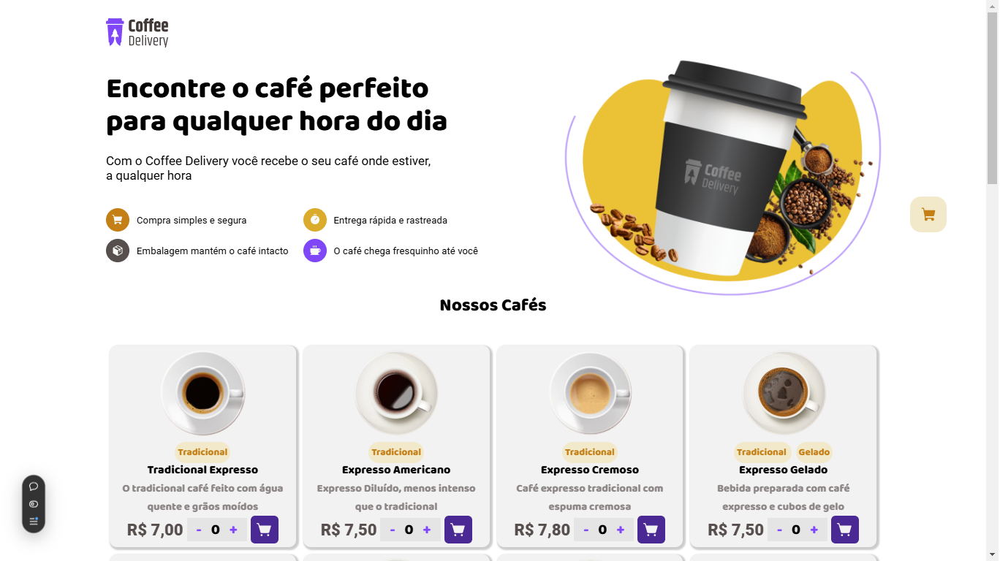
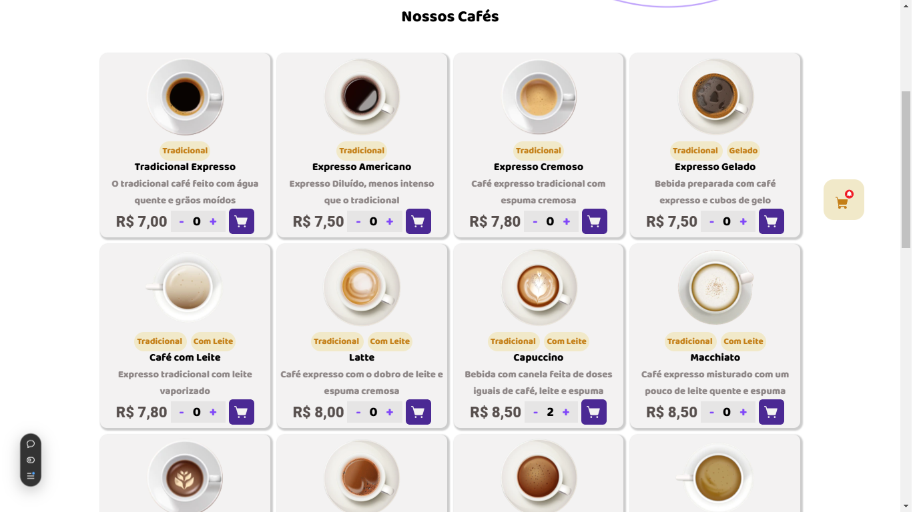
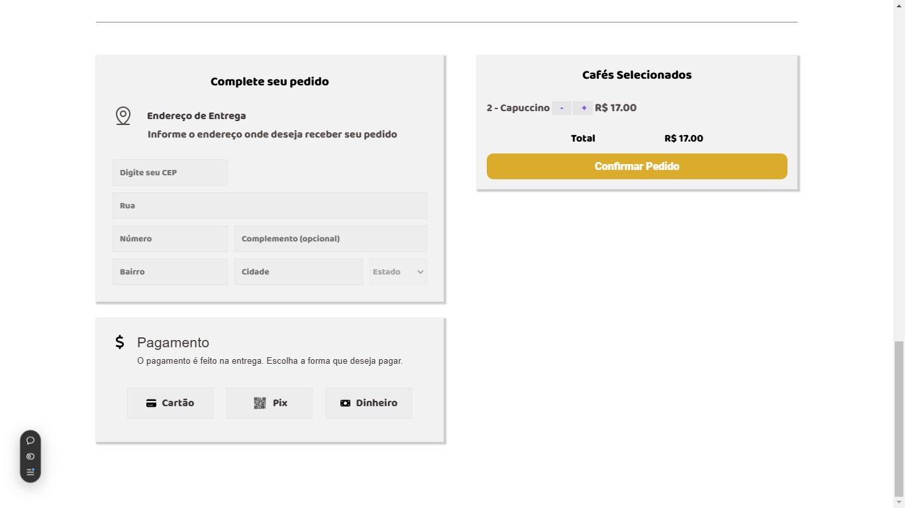
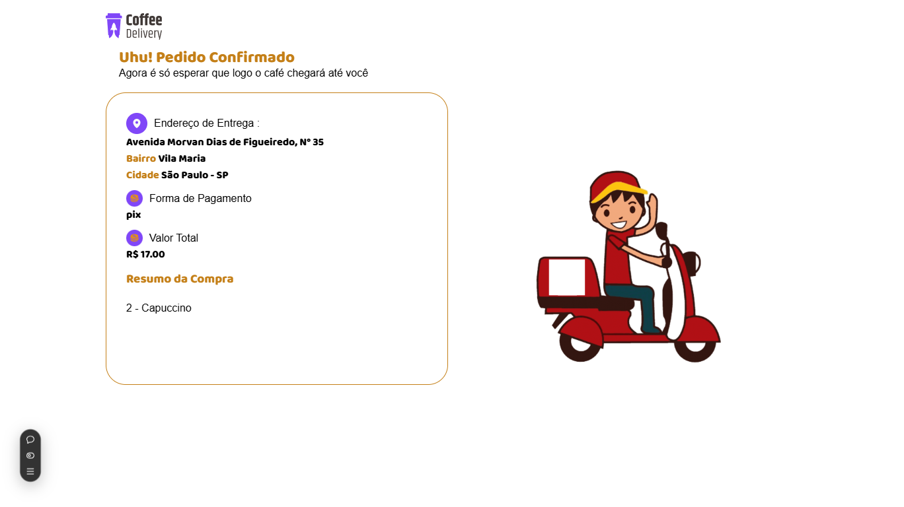
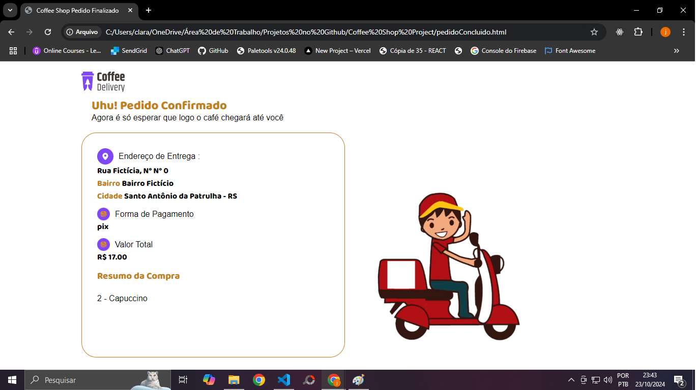

# Coffee Shop - Figma

## Descrição
Site realizado com o intuito de simular pedidos feitos em uma cafeteria online.
O site possui um design bem bonito e interativo. Você pode visualizar as imagens do mesmo logo abaixo.

## Imagens do site

  
 Cartão de visitas 

  

  
 Cafés comercializados 

  

  
 Seção de conclusão do pedido 

  

  
 Preenchendo endereço e escolhendo o meio de pagamento 

  

  
 Pedido concluído 

  

## Tecnologias Utilizadas
- HTML
- CSS
- JavaScript
- API viacep

## Fluxo e Funcionalidades
- Seleção e quantidade de cafés desejados
- Adição de cafés no carrinho do site clicando no ícone roxo do card após indicar a quantidade
- Após adicionar os cafés no carrinho, você pode clicar no carrinho flutuante localizado à direita do site para ir direto para a seção de conclusão do pedido.
- Nessa seção exite a funcionalidade API via-cep para localizar seu endereço baseado no CEP e facilitar o preenchimento do formulario
- Após isso escolha o meio de pagamento oferecido
- Confirme se os itens desejados estão na seção de cafés selecionados e confirme o pedido.
- Após isso você será redirecionado para uma página onde poderá visualizar que o pedido foi feito.

## Licença
MIT

## Conclusão
O projeto Coffee Shop é uma demonstração prática de como integrar design, funcionalidade e APIs externas para criar uma experiência agradável e eficiente para os usuários. Além de simular uma cafeteria online, este projeto evidencia a importância de boas práticas em front-end, manipulação de dados com JavaScript, e consumo de APIs como a ViaCEP. Ele também reflete o aprendizado contínuo e a aplicação de tecnologias essenciais para o desenvolvimento web. Sinta-se à vontade para explorar, dar feedback ou adaptar o código para suas próprias ideias!
